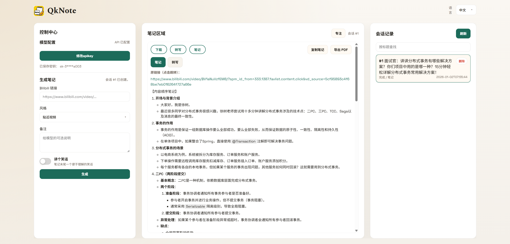

<p align="center">
  
</p>

<h1 align="center">Fast AI Note (QkNote)</h1>

<p align="center">
  <em>只需配置阿里千问 API，即可快速生成 Bilibili 视频笔记</em>
</p>

<p align="center">
  
  
  
</p>

## 项目简介

Fast AI Note 是一个聚焦“快速生成笔记”的视频笔记工具。输入 Bilibili 链接，系统会自动下载音频，并通过阿里千问完成转写与笔记生成。无需本地转写模型，无需复杂配置。

## 核心亮点

- **只需配置千问 API**：无需本地 Whisper/转写模型。
- **一键首启**：双击 `scripts\first-run.cmd` 完成依赖安装 + 启动。
- **快速出笔记**：从链接到 Markdown 笔记，一步完成。

## 功能特性

- **Bilibili 链接输入**：自动下载音频并生成笔记。
- **多种笔记风格**：贴近视频 / 理解记忆 / 简明扼要 / 朋友圈。
- **备注 + 轻松笑话**：可追加备注，支持笔记末尾小笑话。
- **笔记/转写双视图**：生成后可在笔记与转写之间切换。
- **实时进度**：下载 / 转写 / 生成步骤可视化。
- **历史会话**：支持搜索、删除与状态查看。
- **复制与导出**：一键复制（自动附带原链接）/ 导出 PDF。
- **专注模式**：切换专注视图更清爽。
- **中英双语**：界面语言可随时切换。

## 界面风格（simple-style-front）

- **暖色手账风**：奶油渐变背景、柔白卡片、低饱和绿点缀。
- **字体搭配**：标题使用 Spectral，正文使用 Space Grotesk。
- **背景结构**：顶部径向高光 + 纵向渐变叠加。
- **卡片与控件**：卡片圆角 16px、控件圆角 10px、细边框与柔和阴影。
- **布局参考**：复刻风格时建议宽度 1100px、顶部 32px、底部 56px。

## 组件与动效规范（qknote-frontend-style）

- **组件类名**：`.qk-card`、`.qk-section-title`、`.qk-status`、`.qk-input`、`.qk-select`、`.qk-textarea`。
- **交互组件**：`.qk-button` / `.qk-ghost`、`.qk-dropdown-*`、`.qk-toggle-group` / `.qk-toggle-btn`。
- **状态与正文**：`.qk-pill` + `is-pending|is-running|is-completed|is-failed`，`.qk-prose`。
- **动效规则**：下拉 0.18s（translateY -6px → 0），内容淡入 0.25s（translateY 6px → 0）。
- **运行环形进度**：`.qk-pill.is-running` 红绿环填充，完成/失败切换状态样式。
- **减少动画**：遵循 `prefers-reduced-motion` 关闭动画。

## 运行特点

- **SSE 实时推送**：会话列表与详情实时更新，无需手动刷新。
- **大音频自动切片**：默认 120 秒分段转写，降低超大音频失败率。
- **同链接缓存复用**：已下载音频复用，减少重复等待。
- **失败自动降级**：filetrans 无有效片段时切换到备用音频模型。
- **本地持久化**：SQLite + 本地音频目录 `backend/data/`。
- **API Key 校验与脱敏**：保存时校验模型可用性，界面仅显示掩码。
- **删除即清理**：删除会话会同时清理本地音频与切片。

## AI 协作流程（beforedo）

- **适用场景**：需要“先计划、确认后执行”的改动或风险操作。
- **三段式沟通**：当下计划 / LLM 的意见 / 需要确认的模糊点。
- **确认后执行**：未收到明确确认前不执行操作。

> 相关技能文档：
> - `skills/simple-style-front/SKILL.md`
> - `skills/qknote-frontend-style/SKILL.md`
> - `skills/beforedo/SKILL.md`

## 界面预览



## 快速开始

### 第一次配置（推荐）

1. 双击运行 `scripts\first-run.cmd`。
2. 打开浏览器 `http://localhost:5173`。
3. 在「模型配置」中输入 DashScope API Key，点击“校验并保存”。
   DashScope API Key 获取地址：https://dashscope.console.aliyun.com/apiKey
4. 粘贴 Bilibili 链接，选择笔记风格，点击“生成”。

### 自动启动方式

```text
scripts\start.cmd
```

脚本会自动检测依赖，必要时先执行安装，再启动前后端。

### 手动启动方式

后端（新开终端）：
```text
cd backend
python -m venv .venv
.\.venv\Scripts\activate
pip install -r requirements.txt
uvicorn app.main:app --reload
```

前端（新开终端）：
```text
cd frontend
npm install
npm run dev
```

前端地址：`http://localhost:5173`  
后端地址：`http://localhost:8000`（API 文档：`http://localhost:8000/docs`）

## 可选配置

- `DASHSCOPE_BASE_URL`：自定义 DashScope base URL（默认 `https://dashscope.aliyuncs.com/api/v1`）。
- `FFMPEG_LOCATION`：指定已安装的 ffmpeg 路径，跳过脚本下载。
